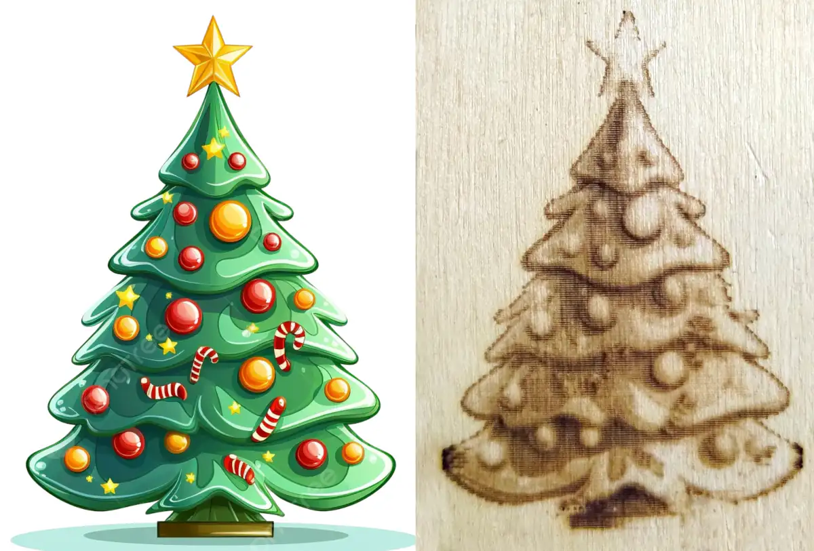

# laserPWMtoFeedrate
Conversion tool to enable proper grayscale (not dithered) laser engraving on 3D printers that don't support PWM on their laser, such as the Ender 3 V2.

This tool allows you to load a gcode file generated using LaserGRBL and use it on Marlin 3D printers that use the M106/M107 commands (fan control) to enable and disable the laser.
There are two options:
- grayscale: converts the files to use variable feed rate and constant laser power to control the brightness of the engraving, instead of using variable laser power and constant speed.
- outline: this option will just replace the M3/M5 commands with M106/M107 commands, adding an optional pause when turning on/off the laser on unsynchronized systems.

You can access the tool from here: https://stefano-panzeri.github.io/laserPWMtoFeedrate/
The files are processed directly in the browser using Javascript, they are not sent to external servers for conversion.

